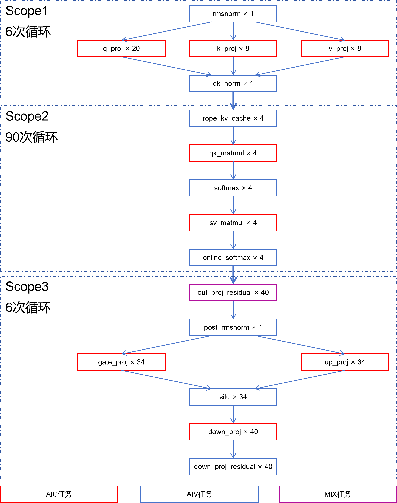
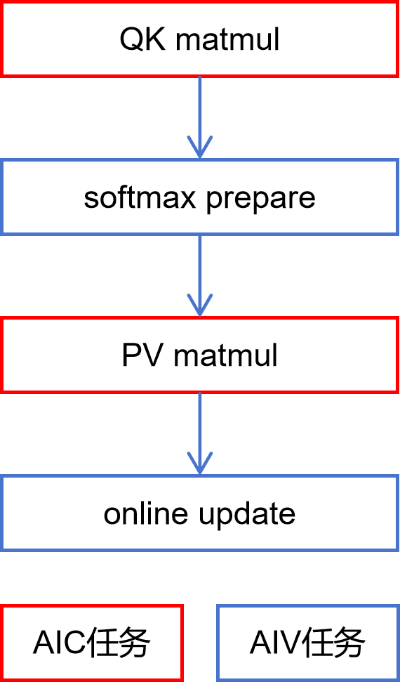

# 样例说明

# 1. Qwen3-14B Benchmark

## 1.1 四种方案

四种方案描述**同一算子图**，差异在于 **构图方式**（全动态 vs 局部静态）与 **依赖建立方式**（任务依赖 manual scope vs 数据依赖 tensormap）。

| 方案 | 名称 | 说明 |
|------|------|------|
| A | qwen3_dynamic_manual_scope 样例 | 全动态构图 + 任务依赖（manual scope） |
| B | qwen3_dynamic_tensormap 样例 | 全动态构图 + 数据依赖（tensormap） |
| C | x | 局部静态构图 + 任务依赖（manual scope） |
| D | x | 局部静态构图 + 数据依赖（tensormap） |

注：x 表示 simpler 不支持，proxy 支持。

### 1.1.1 实际样例目录

本仓库 `qwen3/` 下的实际样例：

| 方案 | 目录 | 入口 / 编排 |
|------|------|------|
| A manual scope | `qwen3/qwen3_dynamic_manual_scope/` | `test_qwen3_decode.py` + `orchestration/qwen3_decode.cpp` + `kernels/{aic,aiv}/` |
| B tensormap | `qwen3/qwen3_dynamic_tensormap/` | `test_qwen3_decode.py` + `orchestration/qwen3_decode.cpp` + `kernels/{aic,aiv}/` |

两样例自包含，无外部公共依赖；golden 校验内置于各自 `test_qwen3_decode.py`，不匹配时把 golden/actual 张量 dump 到 `outputs/golden_mismatch/` 供离线排查。

## 1.2 样例设计

### 1.2.1 a2a3 上各 kernel 执行时间

数据来自 `merged_swimlane.json` 的 **AICore View**（test_qwen3_decode.py `-p a2a3 --enable-l2-swimlane` 一次实测）；"实例数"= AICore View 中的子任务事件数，SPMD 任务（`set_block_num(N)` > 1）按子任务数量统计。

测试基于的simpler版本：61ba501

| id | Kernel | core | 实例数 | 总耗时(us) | 均值 | min | max | median | P90 | P99 |
|---:|---|---|---:|---:|---:|---:|---:|---:|---:|---:|
| 0 | rmsnorm | aiv | 6 | 143.7 | 23.95 | 19.10 | 26.34 | 25.05 | 26.00 | 26.34 |
| 1 | q_proj | aic | 120 | 3127.8 | 26.06 | 22.00 | 46.80 | 22.63 | 41.54 | 46.74 |
| 2 | k_proj | aic | 48 | 872.2 | 18.17 | 12.94 | 39.98 | 14.14 | 38.68 | 39.98 |
| 3 | v_proj | aic | 48 | 858.9 | 17.89 | 13.12 | 38.78 | 14.05 | 37.14 | 38.78 |
| 4 | qk_norm | aiv | 6 | 79.2 | 13.19 | 12.58 | 14.18 | 13.03 | 13.62 | 14.18 |
| 5 | rope_kv_cache | aiv | 90 | 853.6 | 9.48 | 7.78 | 13.06 | 9.23 | 11.34 | 12.94 |
| 6 | qk_matmul | aic | 360 | 10567.0 | 29.35 | 2.58 | 65.96 | 28.04 | 50.40 | 63.62 |
| 7 | softmax | aiv | 360 | 6984.4 | 19.40 | 2.12 | 43.64 | 18.29 | 31.38 | 38.06 |
| 8 | sv_matmul | aic | 360 | 11395.2 | 31.65 | 2.78 | 61.82 | 30.59 | 55.34 | 59.74 |
| 9 | online_softmax | aiv | 360 | 7494.1 | 20.82 | 1.08 | 54.82 | 19.15 | 37.80 | 50.50 |
| 10/11 | out_proj_residual | mix | 240 | 9779.0 | 40.75 | 12.90 | 141.66 | 26.14 | 116.78 | 133.22 |
| 12 | post_rmsnorm | aiv | 6 | 146.3 | 24.39 | 19.98 | 31.54 | 23.26 | 27.06 | 31.54 |
| 13 | gate_proj | aic | 204 | 19522.8 | 95.70 | 66.84 | 139.36 | 95.29 | 101.42 | 138.32 |
| 14 | up_proj | aic | 204 | 19817.1 | 97.14 | 68.46 | 135.00 | 96.65 | 103.80 | 133.34 |
| 15 | silu | aiv | 204 | 575.9 | 2.82 | 2.12 | 4.06 | 2.76 | 3.38 | 3.72 |
| 16 | down_proj | aic | 240 | 17333.9 | 72.22 | 41.66 | 173.20 | 50.20 | 129.52 | 171.64 |
| 17 | down_proj_residual | aiv | 240 | 621.7 | 2.59 | 0.98 | 8.70 | 1.89 | 5.38 | 8.62 |
| | **TOTAL** | | **3096** | **110172.7** | 35.59 | 0.98 | 173.20 | 23.05 | 96.42 | 130.64 |

注：
  - mix任务单实例时间 = max(aic_dur, aiv_dur_1, aiv_dur_2)，按每个 launch 内 aic/aiv 时长降序 rank 配对计算（aiv 配对 2 个，取 max；它们在同一 AICore 的两个 vector unit 并行执行）
  - sum/mean/min/max/median/P90/P99 取自这 240 个 mix 实例时长
- 其它行：均值 = 总耗时 / 实例数；min/max/median/P90/P99 为子任务级分位数。

### 1.2.2 AIC vs AIV 平均时长

| core | 子任务实例数 | 总耗时(us) | 平均时长(us) | min | max | median | P90 | P99 |
|---|---:|---:|---:|---:|---:|---:|---:|---:|
| **AIC**（纯 cube） | 1584 | 83494.9 | **52.71** | 2.58 | 173.20 | 42.76 | 99.12 | 134.62 |
| **AIV**（纯 vector） | 1272 | 16898.9 | **13.29** | 0.98 | 54.82 | 10.06 | 30.40 | 43.38 |
| **MIX**（cube+vector） | 240 | 9779.0 | **40.75** | 12.90 | 141.66 | 26.14 | 116.78 | 133.22 |
| 全部 | 3096 | 110172.7 | 35.59 | 0.98 | 173.20 | 23.05 | 96.42 | 130.64 |

benchmark 测试时，如果需要模拟 AIC/AIV 任务，可参照 AIC/AIV 平均时长。

## 1.3 SPMD 方案设计

同一算子图提供两套 SPMD 编排：**基础设计方案**（`qwen3/basic/`）与 **V200 硬件团队建议方案**（`qwen3/all_spmd/`）。二者算子图、Scope 划分、依赖语义完全一致，差异仅在于**哪些算子用 SPMD 展开**：basic 在注意力 matmul、online_softmax、gate/up/silu 处用 SPMD，而 out_proj、q/k/v_proj、down_proj 系列按 chunk 逐 task launch；all_spmd 把所有可展开的 chunk 循环（含 out_proj）都收敛为一次 SPMD launch。两个目录下各含 `qwen3_dynamic_manual_scope/` 与 `qwen3_dynamic_tensormap/` 两个样例（仅依赖建立方式不同，见 1.1）。

### 1.3.1 基础设计方案（basic）

**设计依据 —— 减少编排压力和调度空隙的平衡**：结合SPMD方案实测数据，优先在收益显著的点位落地SPMD优化，同时约束`block_num`取值不宜过大；**不同作用域（Scope）对应的外层循环迭代不做合并式SPMD调度**。
基准策略划分如下：针对中间维尺寸偏大、单次Launch原生具备并行条件的算子（注意力模块qk、softmax、sv_matmul、online_softmax，以及MLP模块gate、up、silu），直接启用SPMD；out_proj拆解为40个独立任务，单个任务负责128列宽度的输出分块，并基于列分块完成C2V流水分片；q/k/v_proj、down_proj与down_proj_residual沿用分块（chunk）粒度逐个提交任务。

对应代码：`qwen3/basic/qwen3_dynamic_manual_scope/`、`qwen3/basic/qwen3_dynamic_tensormap/`。

| Scope | 算子 | 类型 | block_num | 是否 SPMD |
|-------|------|------|-----------|-----------|
| **Scope1** | input rmsnorm | AIV | — | 否（single） |
| | q_proj | AIC | — | 否（20 次 chunk launch） |
| | k_proj | AIC | — | 否（8 次 chunk launch） |
| | v_proj | AIC | — | 否（8 次 chunk launch） |
| | qk_norm | AIV | — | 否（single） |
| **Scope2** | rope_kv_cache | AIV | — | 否（single，每 batch） |
| | qk_matmul | AIC | 4 | 是 |
| | softmax | AIV | 4 | 是 |
| | sv_matmul | AIC | 4 | 是 |
| | online_softmax | AIV | 4 | 是 |
| **Scope3** | out_proj（mixed） | MIX | — | 否（40 次单 task launch，每 task 一个输出列块） |
| | post_rmsnorm | AIV | — | 否（single） |
| | gate_proj | AIC | 34 | 是 |
| | up_proj | AIC | 34 | 是 |
| | silu | AIV | 34 | 是 |
| | down_proj | AIC | — | 否（40 次 chunk launch） |
| | down_proj_residual | AIV | — | 否（40 次 chunk launch） |

### 1.3.2 V200 硬件团队建议方案（all_spmd）

**设计依据 —— 缓解 V200 Orchestrator 压力**：V200 的 AICore 核数远多于 A2/A3，能在 SPMD 处并行展开的算子优先 SPMD，以减轻 Orchestrator 逐 task 调度负担。在 basic 基础上，把剩余仍按 chunk 逐 task 提交的算子也收敛为**一次 SPMD launch**：q/k/v_proj（block_num 20/8/8）、out_proj（block_num 40）、down_proj/down_proj_residual（block_num 40）；Scope 划分与组间依赖与 basic 保持一致。

对应代码：`qwen3/all_spmd/qwen3_dynamic_manual_scope/`、`qwen3/all_spmd/qwen3_dynamic_tensormap/`。

| Scope | 算子 | 类型 | block_num | 是否 SPMD |
|-------|------|------|-----------|-----------|
| **Scope1** | input rmsnorm | AIV | — | 否（single） |
| | q_proj | AIC | 20 | 是 |
| | k_proj | AIC | 8 | 是 |
| | v_proj | AIC | 8 | 是 |
| | qk_norm | AIV | — | 否（single） |
| **Scope2** | rope_kv_cache | AIV | — | 否（single，每 batch） |
| | qk_matmul | AIC | 4 | 是 |
| | softmax | AIV | 4 | 是 |
| | sv_matmul | AIC | 4 | 是 |
| | online_softmax | AIV | 4 | 是 |
| **Scope3** | out_proj（mixed） | MIX | 40 | 是 |
| | post_rmsnorm | AIV | — | 否（single） |
| | gate_proj | AIC | 34 | 是 |
| | up_proj | AIC | 34 | 是 |
| | silu | AIV | 34 | 是 |
| | down_proj | AIC | 40 | 是 |
| | down_proj_residual | AIV | 40 | 是 |

## 1.4 局部静态构图（原理）

方案 **C / D** 采用局部静态构图。本节只描述设计原理，不涉及具体实现。每个 Scope 的每次循环内部使用静态构图，原理如下：

### 1.4.1 每个 Scope 的每次循环内部设计静态构图

三个 Scope 各对应一种静态子图，外层循环每迭代一次实例化一份：

| Scope | 循环维度 | 迭代次数 | 静态子图 |
|-------|------|---------|----------|
| Scope1 Prefill | tile | 6 | G1：rmsnorm → q/k/v_proj → qk_norm |
| Scope2 Attention | batch | 90 | G2：rope → qk_mm → softmax → sv_mm → online |
| Scope3 MLP | tile | 6 | G3：out_proj → post_rms → gate/up → silu → down → down_res |

子图拓扑与 SPMD `block_num` 在多次迭代间不变，仅基址、Tensor 地址及标量（tile/batch 偏移、有效行数等）随迭代变化。

### 1.4.2 静态图模板：先给模板，构图时填入具体 Tensor

涉及静态构图的地方，先给出静态图模板（任务类型 / 模式 / block_num / 槽位等结构信息固定），实际构图时再把模板中的槽位填上当次迭代的具体 Tensor 与标量。模板本身不含运行时地址，因此同一模板可被一个 Scope 的全部迭代复用。

### 1.4.3 静态子图内部依赖：在已有任务编号上加偏移量

静态子图内部的依赖在模板里以**相对基址的相对编号**表达；实例化某次迭代时，只需对这些相对编号统一加上该次迭代的基址偏移量，即可得到本次迭代的实际任务依赖。整组内部依赖一次定义、所有迭代复用，无需在循环里逐条重建边。

### 1.4.4 静态子图之间的依赖：将静态图视作整体建立边界依赖

将每个静态子图视作一个整体，只对整体的边界输入/输出建立依赖，组内依赖不再重复；边界依赖既可手动建立（manual scope），也可由 tensormap 按数据自动建立：

| 组间路径 | 边界输出 | 边界输入 |
|----------|----------|----------|
| G1 → G2 | tile 上 v_proj、q_proj_norm、k_proj_norm | G2 rope |
| G2 → G3 | batch 的 attn_out | G3 out_proj（对应 tile 行区间） |
| G3 → 外部 | down_proj_residual → 外部输出 | — |

- **C（manual scope）**：把子图整体当作一个宏节点，组间按边界产出/消费手动连边。
- **D（tensormap）**：组内仍用静态依赖；组边界注册产出、查找消费，按 Tensor view 重叠自动连边。

---

# 2. Paged Attention Benchmark

## 2.1 两种方案

两种方案描述**同一 paged attention decode 算子图**，差异在于 **依赖建立方式**（任务依赖 manual scope vs 数据依赖 tensormap）；二者构图均为全动态 unroll 分组。

| 方案 | 名称 | 说明 |
|------|------|------|
| A | paged_attention_unroll_manual_scope 样例 | 全动态 unroll 构图 + 任务依赖（manual scope） |
| B | paged_attention_unroll 样例 | 全动态 unroll 构图 + 数据依赖（tensormap） |

### 2.1.1 实际样例目录

本仓库 `paged_attention/` 下的实际样例：

| 方案 | 目录 | 入口 / 编排 |
|------|------|------|
| A manual scope | `paged_attention/paged_attention_unroll_manual_scope/` | `test_paged_attention_unroll.py` + `kernels/orchestration/paged_attention_orch.cpp` + `kernels/{aic,aiv}/` |
| B tensormap | `paged_attention/paged_attention_unroll/` | `test_paged_attention_unroll.py` + `kernels/orchestration/paged_attention_orch.cpp` + `kernels/{aic,aiv}/` |

两方案 kernel 集合、func_id、签名完全一致，仅编排的 scope 模式不同（`PTO2_SCOPE(MANUAL)` vs 默认 `PTO2_SCOPE()`）。

## 2.2 样例设计

外层对每个 batch 的每个 q-head tile 开一个 Scope；Scope 内把 KV 序列按 `N_UNROLL` 个 block 分为若干组，每组提交固定 **4 个 task**，组间通过在线 softmax 累加（running max/sum + 累加输出）串接。

### 2.2.1 Case1 参数

| 参数 | 值 |
|------|----|
| batch | 480 |
| num_heads | 16 |
| kv_head_num | 1 |
| head_dim | 128 |
| block_size | 128 |
| context_len | 8192 |
| max_model_len | 32768 |
| dtype | bfloat16 |
| N_UNROLL | 64（块/组） |

按 Case1：`q_tile = min(num_heads, 128) = 16` → 每 batch 1 个 q-loop；`bn_this_batch = ceil(context_len/block_size) = 64` 块，`N_UNROLL = 64` → 每 (batch, q tile) 1 组 × 4 task，合计 480 × 1 × 4 = **1920 task**。

### 2.2.2 每组 4 个 kernel

| func_id | kernel | core | 源文件 | 作用 |
|---:|------|------|--------|------|
| 0 | QK matmul | aic | `kernels/aic/aic_qk_matmul.cpp` | `qi @ K^T`，对本组 N_UNROLL 个 block → `sij_buf` |
| 1 | softmax_prepare | aiv | `kernels/aiv/aiv_softmax_prepare.cpp` | 两遍 softmax → `pij_buf`、`mi`、`li` |
| 2 | PV matmul | aic | `kernels/aic/aic_pv_matmul.cpp` | SplitK 累加 `P @ V` → `oi_new` |
| 3 | online_update | aiv | `kernels/aiv/aiv_online_update.cpp` | 在线 softmax 累加 `mi/li/oi`，写回 `out` |

### 2.2.3 Case1 各 kernel 执行时间（实测）

数据来自 a2a3 实测（`-p a2a3 --enable-l2-swimlane`）的 `merged_swimlane.json` **AICore View**，每个 kernel 恰好 480 个子任务实例（480 batch × 1 组 × 4 task = 1920）。

测试基于的simpler版本：4898057

| func_id | kernel | core | 实例数 | 总耗时(us) | 均值 | min | max | median | P90 | P99 |
|---:|---|---|---:|---:|---:|---:|---:|---:|---:|---:|
| 0 | QK matmul | aic | 480 | 24782.0 | 51.63 | 43.06 | 59.94 | 51.79 | 55.00 | 57.95 |
| 1 | softmax_prepare | aiv | 480 | 28233.9 | 58.82 | 43.74 | 68.28 | 59.23 | 62.63 | 64.93 |
| 2 | PV matmul | aic | 480 | 25254.8 | 52.61 | 32.40 | 60.44 | 53.34 | 56.52 | 58.73 |
| 3 | online_update | aiv | 480 | 1230.6 | 2.56 | 1.34 | 5.02 | 2.50 | 3.32 | 4.14 |
| | **TOTAL** | | **1920** | **79501.3** | 41.41 | 1.34 | 68.28 | 52.39 | 59.98 | 63.84 |

## 2.3 Unroll 分组与依赖设计

### 2.3.1 选取依据

1. **unroll 分组降低 task 数**：把一个 (batch, q tile) 的 KV 序列按 `N_UNROLL = 64` 个 block 合并为一组，一组只提交 4 个 task，显著减少 task 数量与 Orchestrator 逐 task 调度压力（Case1：480 batch × 1 组 × 4 = 1920 task）。
2. **在线 softmax**：组内 PV 用 SplitK 累加；组间用 `online_update` 维护 running max/sum（`mi`/`li`）与累加输出 `oi`，无需缓存全部注意力分数。

### 2.3.2 组内与组间依赖

组内固定链：`QK → softmax_prepare → PV → online_update`。

- **A（manual scope）**：`PTO2_SCOPE(MANUAL)`，逐 task `set_dependencies` 显式连边；`online_update` 额外依赖上一组的 `online_update`（`pre_task_id`）形成跨组累加链，末组再依赖 `alloc` 以延长 scratch 缓冲生命周期。
- **B（tensormap）**：默认 `PTO2_SCOPE()`，按 Tensor view（`sij_buf` / `pij_buf` / `mi` / `li` / `oi_new` 等）自动建立数据依赖；跨组累加经 `mi`/`li`/`oi` 的 INOUT 视图自动串接。

---

# 修改历史

### 2026/6/3
1. 文档整体重构为"四种方案"框架：用表格归纳方案 A/B（simpler 支持）与 C/D（仅 proxy 支持），并采用 1 / 1.1 / 1.1.1 分级编号。
2. 新增"实际样例目录"：列出 `qwen3/` 下各样例目录、入口/编排文件。
3. 新增"样例设计"节算子图（`Qwen3-14B-Decode.png`）；kernel 执行时间参考数据并入该节。
4. 新增"SPMD 方案设计"节：SPMD 选取依据，以及各 Scope 的 SPMD / block_num 使用明细。
5. 新增"局部静态构图（原理）"节：静态子图划分、模板化构图、组内依赖偏移、组间边界依赖等设计原理。
6. 修改历史改为按日期倒序排序。
7. 新增第 2 节"Paged Attention Benchmark"（格式仿照第 1 节）：参照 `paged_attention/` 下 unroll（tensormap）与 manual_scope 两个实际样例，给出方案/实际样例目录、Case1 参数、每组 4 个 kernel、unroll 分组与组内/组间依赖设计。
8. 新增 Paged Attention 算子图 `images/Paged-Attention.png`（仿照 `Qwen3-14B-Decode.png` 风格绘制）。
9. 新增 2.2.3「Case1 各 kernel 执行时间（实测）」：参照 `simpler/outputs/TestPagedAttentionUnroll_a2a3`（tensormap）与 `TestPagedAttentionUnrollManualScope_a2a3`（manual scope）的 `merged_swimlane.json` AICore View，按 QK/SF/PV/UP 聚合，batch=480 各 480 实例；删去 2.2.2 末尾「暂无 `merged_swimlane.json`，待实测」的占位说明。
10. 移除 `dependency/`（`qwen3_hooks.py`、`output_compare_heatmap.py`），qwen3 两样例改为自包含：从两个 `test_qwen3_decode.py` 去掉 golden/输入磁盘缓存、启动 banner 与 device-run 日志、不匹配热力图绘制；golden 计算与宽松比较保留，不匹配时仅 dump `.pt` 到 `outputs/golden_mismatch/`。

### 2026/5/30
kernel 执行时间参考数据按 `merged_swimlane.json` 的 **AICore View** 重新实测：
1. 数据源：test_qwen3_decode.py（`-p a2a3 --enable-l2-swimlane`）的 `simpler/outputs/.../merged_swimlane.json`，pid=1 AICore View 的全部 `ph='X'` 子任务事件，按 kernel 名聚合统计。
2. 口径：SPMD 任务（`set_block_num(N)`>1）按子任务数量统计，即每个 AICore View 事件为一个子任务实例。
3. id=10/11 `out_proj_residual` 是同一个 mix 任务（aic+aiv 同步执行），aic/aiv 两行合并为单行（type=mix）：实例数按 aic 子任务数 = 240（实测 aic 半每次 launch 40 个、aiv 半每次 launch 80 个，每个 mix 实例 = 1 个 aic + 同 AICore 上 2 个并行 aiv，单实例时间取三者 max，按每次 launch 内时长降序 rank 配对）。
4. 总耗时 110172.7 us 是统计样本（纯 aic + 纯 aiv 子任务 + 240 个 mix 实例时长）的累加，不是 wall-clock。

旧数据（5/28 task-launch 口径，aic/aiv 分行）：

| id | Kernel | core | 实例数 | 总耗时(us) | 均值(us) |
|---:|---|---|---:|---:|---:|
| 6 | qk_matmul | aic | 90 | 2655.0 | 29.50 |
| 7 | softmax | aiv | 90 | 1801.0 | 20.01 |
| 8 | sv_matmul | aic | 90 | 2833.0 | 31.48 |
| 10 | out_proj_residual_aic | aic | 6 | 261.5 | 43.59 |
| 11 | out_proj_residual_aiv | aiv | 6 | 547.4 | 91.23 |
| | **TOTAL** | | **2058** | **80769.0** | 39.25 |

| core | 实例数 | 总耗时(us) | 平均时长(us) |
|---|---:|---:|---:|
| AIC | 1050 | 68467.2 | 65.21 |
| AIV | 1008 | 12301.7 | 12.20 |
| 全部 | 2058 | 80769.0 | 39.25 |

### 2026/5/28
补充 qwen3 样例的 kernel 执行时间参考数据。

### 2026/5/27
增加 simpler 版本的样例：
· 基于 Qwen3 设计的 dynamic_manual_scope 样例
· 基于 Qwen3 设计的 dynamic_tensormap 样例
· 基于 Qwen3 设计的 block_table 样例
