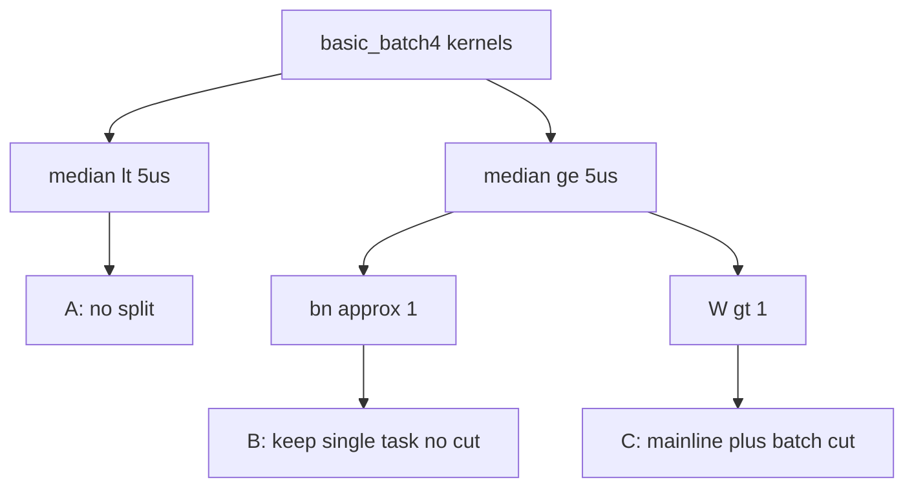

# Flash CSA：按 batch=4 粒度决定拆 / 不拆

数据源：[`basic_batch4_mtp1`](../deepseek_v4_flash_csa/basic_batch4_mtp1)（B=4 已知泳道，逻辑任务 median）。

关联：[`sched_demand_a2a3_to_a5.md`](sched_demand_a2a3_to_a5.md) · [`ht_lt_scene_caliber.md`](ht_lt_scene_caliber.md)

## 规则

1. **median &lt; 5µs → 不拆**。
2. **原来只有 1 个任务（bn≈1 / 主线 W≈1）→ 不切**（即使 median ≥5µs 也不改成 `spmd(5)`）。
3. **median ≥ 5µs 且主线 W>1 → 拆**：从现有主线出发，**再按 batch 切一刀**（不替换主线）：
   `5×spmd(W)` / `spmd(5*W)`，lane→`(batch, 主线条带)`。

LT 目标：**B=5**；仅对第 3 类叠 batch 维。上板后若单 lane 过碎则回退并记入本文件。

统一拆法示意：

```text
# 主线宽度 W = 现有 block_num / SPMD 条数
pl.spmd(5 * W)   或   for b in range(5): pl.spmd(W)
lane -> (b, w) = (lane // W, lane % W)
```

禁止：用裸 `spmd(5)` **替换**原主线（丢掉 W）。

---

## A. 不拆（median &lt; 5µs）— 共 19 个

| kernel | kind | block_num | median (µs) |
|--------|------|----------:|------------:|
| `kv_touch` | AIV | 1 | 1.50 |
| `kv_proj_seed` | AIV | 1 | 1.54 |
| `weights_proj_reduce` | AIV | 1 | 1.68 |
| `rope_interleave` | AIV | 1 | 1.78 |
| `qr_proj_seed` | AIV | 1 | 2.02 |
| `qr_rope_swap_idx` | AIV | 1 | 2.04 |
| `hc_pre_linear_reduce` | AIV | 1 | 2.08 |
| `idx_qr_proj_dequant` | AIV | 8 | 2.25 |
| `quant` | AIV | 1（×O_GROUPS） | 2.36 |
| `qr_hadamard_matmul` | AIC | 8 | 2.50 |
| `rope_interleave_0` | AIV | 1 | 2.52 |
| `q_rope_prepare` | AIV | 1 | 2.62 |
| `csa_cmp_rope` | AIV | 1 | 2.76 |
| `split_pre_post` | AIV | 1 | 2.92 |
| `rope_cs` | AIV | 1 | 3.34 |
| `kv_hadamard` | AIC | 1 | 3.64 |
| `proj_b_act` | AIV | 8 | 4.50 |
| `qr_rope` | AIV | 16 | 4.67 |
| `qr_rms_norm_quant` | AIV | 1 | 4.88 |

---

## B. 不切（原只有 1 个任务，bn≈1）— 共 13 个

median 虽 ≥5µs，但主线本就是单任务，**不**改成 `spmd(5)` / 不按 batch 再切。

| kernel | kind | bn | median (µs) |
|--------|------|---:|------------:|
| `csa_cache_writeback` | AIV | 1 | 5.04 |
| `csa_slots_build_valid_qk_plan` | AIV | 1 | 5.66 |
| `kv_rms_norm_rope` | AIV | 1 | 6.68 |
| `csa_rope_step` | AIV | 1 | 6.98 |
| `kv_and_cache_write` | AIV | 1 | 8.72 |
| `hc_pre_rms` | AIV | 1 | 9.68 |
| `scatter_softmax_pool` | AIV | 1 | 10.06 |
| `scatter_softmax_pool_0` | AIV | 1 | 10.76 |
| `rms_norm` | AIV | 1 | 10.84 |
| `rmsnorm_rope_cache_write` | AIV | 1 | 12.42 |
| `comb_sinkhorn` | AIV | 1 | 14.12 |
| `rmsnorm_rope` | AIV | 1 | 27.72 |
| `prefetch_o_proj_w` | AIV | 1 | 29.26 |

---

## C. 拆（≥5µs 且主线 W>1）— 主线 + batch 再切 → `5×W` — 共 18 个

| kernel | kind | bn(now)=W | median | 改法 |
|--------|------|----------:|-------:|------|
| `mix_x` | AIV | 4 | 5.31 | 主线×batch → `5×4` |
| `hc_post` | AIV | 8 | 5.34 | `5×8` |
| `weights_proj` | AIC | 4 | 5.42 | `5×4` |
| `score_aic` | MIX | 16 | 5.72 | `5×16`（**seq_len 相关**） |
| `qr_hadamard_quant` | AIV | 8 | 5.81 | `5×8` |
| `proj_b_mm` | AIC | 8 | 6.23 | `5×8` |
| `qproj_dequant_rms_nope_rope` | AIV | 16 | 6.75 | `5×16` |
| `topk` | AIV | 8 | 7.15 | 主线(T)保留 + 按 batch 再切 |
| `kv_proj_matmul` | AIC | 16 | 8.04 | `5×16` |
| `hc_pre_linear` | AIC | 4 | 9.30 | `5×4` |
| `qproj_matmul` | AIC | 64 | 9.45 | `5×64` |
| `kv_score_proj_0` | AIC | 8 | 10.00 | `5×8` |
| `proj_a_mm` | AIC | 8 | 10.15 | `5×8` |
| `qk_pv_aic` | MIX | 24 | 11.54 | `5×NUM_QK_CORES` |
| `merge_norm` | AIV | 32 | 11.65 | `5×32` |
| `qr_proj_matmul` | AIC | 16 | 13.35 | `5×16` |
| `kv_score_proj` | AIC | 16 | 18.22 | `5×16` |
| `idx_qr_proj_matmul` | AIC | 8 | 20.22 | `5×8` |

代码模板（与 HT/LT serving 叶一致）：

```python
for tile_i in pl.range(N_BATCH_TILES):  # N_BATCH_TILES=5, BATCH_TILE=1 → B=5
    with/for pl.spmd(W, name_hint=...):
        t_base = tile_i * T_TILE_BATCH
        # 只处理本刀 token；主线条带 w 不变
```

---

## 汇总

| 类别 | 个数 | 动作 |
|------|-----:|------|
| A 不拆（&lt;5µs） | 19 | 不动 |
| B 不切（原 bn≈1） | 13 | 不动 |
| C 拆（≥5µs 且 W>1） | 18 | 主线 + batch → `5×W` |
| **合计** | **50** | — |



## 上板叶

目标叶：[`deepseek_v4_flash_csa/lt_batch5_mtp7`](../deepseek_v4_flash_csa/lt_batch5_mtp7)
（B=5 S=8 mtp=7，`BATCH_TILE=1`，`N_BATCH_TILES=5`，`T_TILE_BATCH=8`）。

实现要点：

- **C 类**：沿用 LT serving 的 `pl.range(N_BATCH_TILES)×pl.spmd(W)`（主线×batch）。
- **B 类（bn≈1）**：已全部收成 `pl.spmd(1)` + 内层 `pl.range(N_BATCH_TILES)`（含 `hc_pre_*` / `q_*` / `kv_touch` / `rms_norm` / `csa_*` / `weights_proj_reduce` 等）。CORE_GROUP 单任务类（`scatter_softmax_*` / `rmsnorm_rope*` / `kv_and_cache_write`）本就未按 batch 切。
- **A 类**：不新增 batch 维；部分宽 SPMD（如 `qr_rope`）仍随 serving 模板按 tile 下发，与 basic 对照时以本清单为准。

上板后按 **C 类单 tile median** 检查是否过碎；过碎则回退该算子并在下表登记。

| kernel | 上板单 tile median (µs) | 结论 |
|--------|------------------------:|------|
| `mix_x` | 3.90 | 过碎(<5) → 回退 |
| `hc_post` | 5.45 | 保留 |
| `weights_proj` | 3.11 | 过碎(<5) → 回退 |
| `score` | 4.95 | 过碎(<5) → 回退 |
| `qr_hadamard_quant` | 6.39 | 保留 |
| `proj_b_mm` | 14.33 | 保留 |
| `qproj_dequant_rms_nope_rope` | 7.07 | 保留 |
| `topk` | 7.60 | 保留 |
| `kv_proj_matmul` | 3.69 | 过碎(<5) → 回退 |
| `hc_pre_linear` | 5.45 | 保留 |
| `qproj_matmul` | 17.18 | 保留 |
| `kv_score_proj_0` | — | 未找到 |
| `proj_a_mm` | 28.56 | 保留 |
| `qk_pv` | 8.29 | 保留 |
| `merge_norm` | 13.94 | 保留 |
| `qr_proj_matmul` | 9.88 | 保留 |
| `kv_score_proj` | 15.36 | 保留 |
| `idx_qr_proj_matmul` | 10.19 | 保留 |

填充命令（泳道落盘后）：

```bash
python3 artifacts/tools/analyze_lt_batch5_c_grain.py
```
